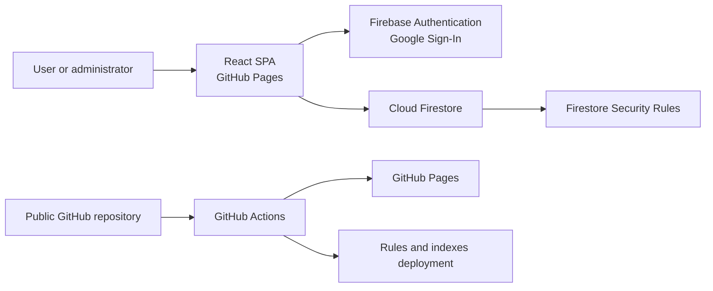

# Architecture

## System context

Home Menu is a static single-page application. GitHub Pages serves HTML,
JavaScript, and CSS. The browser communicates directly with Firebase
Authentication and Cloud Firestore, which form the serverless backend.



There is no custom runtime server, Cloud Function, or scheduler in the MVP.

## Technology decisions

- React with strict TypeScript
- Vite
- Material UI with a mobile-first theme
- React Router `HashRouter`
- `i18next` and `react-i18next`
- Firebase modular Web SDK
- React Context only for authentication and authorization state
- typed Firestore hooks using `onSnapshot`
- pure TypeScript domain functions

## Agent workflow and documentation architecture

Repository automation follows the root `AGENTS.md` router. Every task starts
with `using-superpowers` and `home-menu-project`; substantial work then moves
through discovery, `brainstorming`, `grill-me`, a repository SPEC, an approved
PLAN, implementation, review, verification, and current documentation updates.

Substantial work includes new features, user-visible workflows, behavior or
business-rule changes, architecture decisions, Firebase schema, Rules, index,
transaction, auth, privacy, deployment, i18n, or multi-layer changes. Minimal
typo fixes, formatting-only edits, behavior-preserving cleanup, documentation
synchronization, and work already covered by an active approved plan do not
need a new SPEC or PLAN.

Historical planning artifacts live under
`docs/specifications/<slug>/{SPEC.md,PLAN.md}` and are immutable after
approval. They document the decision at the time it was approved. Current
system behavior belongs in this `docs/` tree. If implementation or future
follow-up work materially changes approved requirements, create a new linked
specification instead of rewriting the old one.

The current documentation may be split into domain-focused files when a topic
becomes too large to navigate. Prefer indexes and links over duplicated rules:
one current document should own each architectural decision.

## Layering

### Presentation

Pages and Material UI components:

- render loading, empty, error, and ready states;
- collect and validate input;
- resolve translation keys;
- call application hooks and commands;
- never issue raw Firestore queries.

### Application

Hooks and use cases:

- subscribe to dishes, ingredients, batches, settings, and orders;
- combine snapshots into view models;
- orchestrate forms and dialogs;
- invoke domain validators;
- invoke infrastructure transactions;
- map domain errors to translation keys.

### Domain

Pure functions without React or Firebase dependencies:

- `evaluateDishAvailability`;
- `canCookStandardBatch`;
- `convertToBaseUnit`;
- `allocateReadyBatchesFifo`;
- `canTransitionOrder`;
- `canCancelOrder`;
- `deriveEffectiveOrderStatus`;
- prepared-batch conservation validators.

### Infrastructure

- Firebase initialization;
- Firestore converters and queries;
- transaction implementations;
- Authentication adapter;
- `Timestamp` conversion;
- error-code normalization.

## Suggested source tree

```text
src/
├── app/
│   ├── App.tsx
│   ├── router.tsx
│   ├── theme.ts
│   └── providers/
├── domain/
│   ├── dishes/
│   ├── inventory/
│   ├── batches/
│   └── orders/
├── features/
│   ├── auth/
│   ├── menu/
│   ├── my-orders/
│   ├── language/
│   ├── admin-dashboard/
│   ├── admin-dishes/
│   ├── admin-inventory/
│   ├── admin-batches/
│   ├── admin-orders/
│   └── settings/
├── infrastructure/
│   └── firebase/
├── locales/
│   ├── en/translation.json
│   └── uk/translation.json
├── shared/
│   ├── components/
│   ├── hooks/
│   ├── types/
│   └── utils/
└── main.tsx
```

Features may import domain, infrastructure, and shared modules. Domain modules
must not import React, Firebase, Material UI, or i18next.

## State and real-time synchronization

`AuthContext` stores only:

- the Firebase Auth user;
- the loaded `users/{uid}` profile;
- the role;
- authentication and authorization state.

Firestore data is not copied into Redux or another global store. Feature hooks
own narrowly scoped subscriptions and unsubscribe on unmount. Route-level
providers may share a subscription where profiling demonstrates duplicate
reads.

## Internationalization

`i18next` is initialized before the application renders:

- supported languages: `uk`, `en`;
- default language: `uk`;
- fallback language: `en`;
- preference storage: browser `localStorage`;
- namespace strategy: start with one `translation` namespace and split by
  feature only when files become difficult to maintain.

Rules:

- no user-facing literal strings in TSX;
- status labels and validation errors use translation keys;
- both locale files must contain the same key set;
- domain and persistence values remain language-neutral enum strings;
- user-created names and descriptions are stored as entered and are not
  automatically translated.

## Routes

`HashRouter` avoids a GitHub Pages SPA fallback:

```text
/#/login
/#/menu
/#/orders
/#/admin
/#/admin/dishes
/#/admin/inventory
/#/admin/inventory/history
/#/admin/batches
/#/admin/orders
/#/admin/settings
```

`RequireAuth` blocks users without an active profile. `RequireAdmin` protects
administrative routes. Route guards are a UX measure; Firestore Rules enforce
the actual authorization boundary.

## Atomic operations

Use `runTransaction` whenever one action changes multiple documents:

- reserve prepared portions;
- cancel a prepared-food reservation;
- complete cooking;
- add or correct ingredient stock;
- discard a prepared batch;
- normalize consumed reservations.

A transaction re-reads current documents, validates invariants, and then writes.
Disabling a submit button improves UX but is not the concurrency guarantee.

## Time-based state without a scheduler

An order stores `scheduledFor`. If it has not been cancelled and
`scheduledFor <= now`, the client derives an effective `consumed` state even if
the persisted state has not yet been normalized.

This eventual consistency does not expose portions to double booking because
they leave `availableQuantity` at reservation time. A later administrator view
or mutation may normalize the persisted order and batch counters.

## Error handling

- Domain failures have stable codes such as `INSUFFICIENT_STOCK`,
  `ORDER_ALREADY_CHANGED`, and `FORBIDDEN_TRANSITION`.
- Presentation maps codes to i18n keys.
- Permission failures must not appear as empty lists.
- A failed transaction must not leave partial updates.
- Raw technical details are logged only in development.
