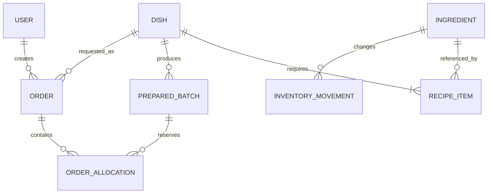

# Firestore data model

## General conventions

- Use English collection and field names.
- Use Firestore-generated IDs except for `users/{uid}` and singleton settings.
- Store time as `Timestamp`, never formatted strings.
- Include `createdAt`, `createdBy`, `updatedAt`, and `updatedBy` where relevant.
- Store quantities in canonical base units.
- Preserve historical names in snapshot fields such as `dishName`.
- Archive with `archivedAt: Timestamp | null`; do not physically delete domain
  history.
- Never store locale-specific status labels in Firestore.

## Relationships



Recipe items are embedded in dishes, and order allocations are embedded in
orders. The logical entities in the diagram do not all require collections.

## `users/{uid}`

```ts
interface UserProfile {
  displayName: string;
  email: string;
  role: 'admin' | 'user';
  active: boolean;
  createdAt: Timestamp;
  updatedAt: Timestamp;
}
```

The document is a non-authoritative display record provisioned manually by
the owner (email/password Auth account plus custom claims); it never
authorizes access. Client code cannot create users or change roles.

## `ingredients/{ingredientId}`

```ts
type BaseUnit = 'piece' | 'gram' | 'milliliter' | 'presence';

interface Ingredient {
  name: string;
  trackingMode: 'quantity' | 'presence';
  baseUnit: BaseUnit;
  quantity: number | null;
  isPresent: boolean | null;
  lowStockThreshold: number | null;
  archivedAt: Timestamp | null;
  createdAt: Timestamp;
  createdBy: string;
  updatedAt: Timestamp;
  updatedBy: string;
}
```

Invariants:

- quantity tracking requires `quantity >= 0`, a non-presence base unit, and
  `isPresent == null`;
- presence tracking requires `baseUnit == presence`, `quantity == null`, and a
  non-null `isPresent`;
- recipes use the ingredient's canonical base unit;
- UI input may use kilograms or liters but converts to grams or milliliters
  before writing.

## `dishes/{dishId}`

```ts
type MealType = 'breakfast' | 'lunch' | 'dinner';

interface RecipeItem {
  ingredientId: string;
  ingredientName: string;
  requiredQuantity: number | null;
  requiresPresence: boolean | null;
}

interface Dish {
  name: string;
  description: string;
  mealTypes: MealType[];
  recipeItems: RecipeItem[];
  archivedAt: Timestamp | null;
  createdAt: Timestamp;
  createdBy: string;
  updatedAt: Timestamp;
  updatedBy: string;
}
```

A recipe describes one standard cooking batch. `ingredientName` is a historical
snapshot; `ingredientId` remains the reference.

Do not persist `isActive` or `canCook`. They are derived from the current
recipe, ingredients, prepared batches, and selected meal type.

Dish names and descriptions are user-generated content. The application does
not translate them automatically.

## `inventoryMovements/{movementId}`

```ts
type MovementType =
  | 'restock'
  | 'cooking'
  | 'correction'
  | 'archive_adjustment';

interface InventoryMovement {
  ingredientId: string;
  ingredientName: string;
  type: MovementType;
  deltaQuantity: number | null;
  presenceBefore: boolean | null;
  presenceAfter: boolean | null;
  balanceAfter: number | null;
  cookingRequestId: string | null;
  preparedBatchId: string | null;
  note: string | null;
  createdAt: Timestamp;
  createdBy: string;
}
```

The collection is append-only. Updating the ingredient and adding its movement
must occur in one transaction.

## `preparedBatches/{batchId}`

```ts
type BatchStatus = 'available' | 'depleted' | 'discarded';

interface PreparedBatch {
  dishId: string;
  dishName: string;
  batchNumber: number | null;
  producedQuantity: number;
  availableQuantity: number;
  reservedQuantity: number;
  consumedQuantity: number;
  discardedQuantity: number;
  preparedAt: Timestamp;
  expiresAt: Timestamp | null;
  status: BatchStatus;
  sourceCookingRequestId: string | null;
  createdAt: Timestamp;
  createdBy: string;
  updatedAt: Timestamp;
  updatedBy: string;
}
```

Conservation invariant:

```text
producedQuantity =
  availableQuantity +
  reservedQuantity +
  consumedQuantity +
  discardedQuantity
```

An expired batch displays a warning but remains available until the
administrator discards it.

`batchNumber` is a global, monotonically increasing, gap-tolerant sequential
number allocated atomically inside the batch-creation transaction (both the
cooking-request completion writer and the ad-hoc admin cooking writer read
and advance the counter document below before writing the batch). It is
immutable once set. Legacy batches written before this field existed have
`batchNumber: null`; the UI falls back to an id-derived display code for
those and never backfills a number onto them.

## `counters/preparedBatchNumber`

```ts
interface PreparedBatchNumberCounter {
  value: number;
}
```

A single top-level document holding the highest `batchNumber` allocated so
far (absent = no batch created yet, effectively 0). Both batch-creation
transactions read this document before any write and set it to `value + 1` in
the same transaction as the batch write, which forces a Firestore retry on
any concurrent conflict — guaranteeing every batch gets a unique, ordered
number without a Cloud Function or dedicated index. Numbers are never reused,
even when a batch is later discarded. Readable by any active user; writable
only by an admin, and only to a strictly increasing `{ value: int }`.

## `orders/{orderId}`

```ts
type OrderKind = 'ready' | 'cook';
type OrderStatus =
  | 'reserved'
  | 'pending'
  | 'approved'
  | 'cooking'
  | 'prepared'
  | 'rejected'
  | 'cancelled'
  | 'consumed';

interface OrderAllocation {
  batchId: string;
  quantity: number;
}

interface Order {
  userId: string;
  userDisplayName: string;
  dishId: string;
  dishName: string;
  kind: OrderKind;
  status: OrderStatus;
  quantity: number;
  mealType: MealType;
  scheduledFor: Timestamp;
  allocations: OrderAllocation[];
  rejectionReason: string | null;
  preparedBatchId: string | null;
  preparedBatchNumber: number | null;
  createdAt: Timestamp;
  createdBy: string;
  updatedAt: Timestamp;
  updatedBy: string;
}
```

`preparedBatchNumber` mirrors the prepared batch's `batchNumber` onto the
order at the same time `preparedBatchId` is set, so the admin board can
render `#NNN` directly from the order without an extra join.

For `ready` orders, quantity must not exceed total available prepared portions.
Allocations may reference several batches because FIFO can span batches.

For `cook` orders, allocations remain empty until cooking is completed. The
requested quantity is reserved from the new prepared batch.

## `settings/general`

```ts
interface GeneralSettings {
  timezone: 'Europe/Kyiv';
  defaultMealTimes: {
    breakfast: string;
    lunch: string;
    dinner: string;
  };
  updatedAt: Timestamp;
  updatedBy: string;
}
```

UI language is a local browser preference, not shared Firestore configuration.

## Derived availability

```ts
interface DishAvailability {
  configured: boolean;
  readyQuantity: number;
  canCook: boolean;
  missingIngredients: Array<{
    ingredientId: string;
    shortage: number | null;
  }>;
}
```

Algorithm:

1. An archived dish is unavailable for new orders.
2. An empty recipe yields `configured = false`.
3. `readyQuantity` is the sum of `availableQuantity` for non-discarded batches.
4. Quantity items require `quantity >= requiredQuantity`.
5. Presence items require `isPresent == true`.
6. `canCook` is true only when every recipe item is satisfied.

## Expected composite indexes

- `orders`: `userId ASC, scheduledFor DESC`
- `orders`: `status ASC, scheduledFor ASC`
- `orders`: `kind ASC, status ASC, scheduledFor ASC`
- `preparedBatches`: `dishId ASC, status ASC, preparedAt ASC`
- `inventoryMovements`: `ingredientId ASC, createdAt DESC`
- `dishes`: `archivedAt ASC, name ASC`

The implementation should update `firestore.indexes.json` from emulator and SDK
feedback and validate it in CI.
