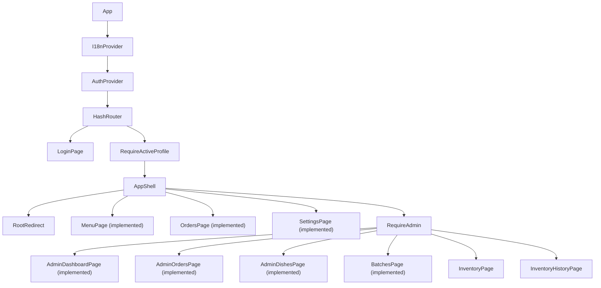
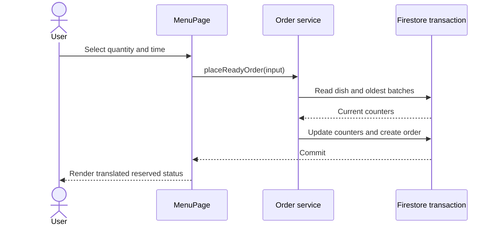
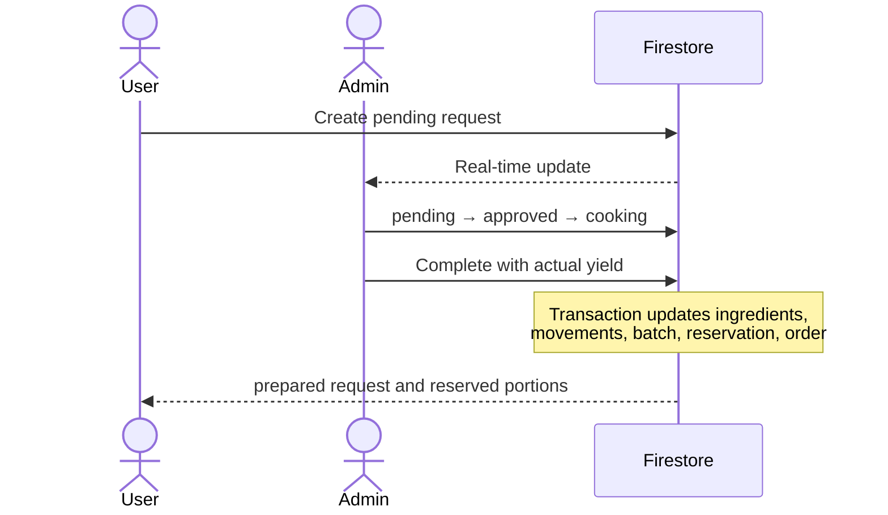

# Components and user flows

## Component map

## Shared components

| Component | Responsibility |
| --- | --- |
| `AppHeader` | Brand mascot, wordmark, language and theme controls; rendered inside `AppShell` only (not on `/login`) |
| `AppShell` | Layout route: header, role-aware responsive navigation (`AppNavDrawer` at `md`+, `AppNavBottom` below it), routed `Outlet` |
| `FeaturePlaceholder` | Localized title plus a shared "coming soon" `StatePlaceholder`, used by every not-yet-built feature screen |
| `RequireActiveProfile` | Wait for Auth and reject unauthenticated or inactive profiles; does not check role |
| `RequireAdmin` | Require the `admin` role |
| `LanguageSwitcher` | Switch `uk`/`en` (UK/EN) and persist the local preference |
| `ColorSchemeToggle` | Toggle binary light↔dark mode and persist it |
| `CatArt` | Brand cat illustration (`idle`/`empty`/`sleeping`/`confused`/`logo`) |
| `StatusChip` | Semantic status pill (`success`/`warning`/`default`) |
| `StatePlaceholder` | Pairs a `CatArt` beat with a message for loading/empty/error |
| `AsyncState` | Consistent loading, error, and empty states |
| `ConfirmDialog` | Confirm destructive or accounting-sensitive operations |
| `QuantityField` | Quantity, display unit, and canonical-unit conversion |
| `DateMealSelector` | Date, meal type, and default/custom time |
| `StatusChip` | Translate domain status enums |
| `ErrorBoundary` | Render a localized recovery screen |

Every visible label, aria-label, validation message, dialog, toast, and empty
state is translated.

### Theme and design system

The application theme (`src/app/theme.ts`) is derived from the design canon in
`docs/design/README.md`: MUI CSS-variable `light` and `dark` color schemes
(default light, user-toggled and persisted), self-hosted Nunito / Nunito Sans
typography, an 8px spacing base, per-surface radii, and component overrides.
`AppHeader`, `LanguageSwitcher`, `ColorSchemeToggle`, and `CatArt` live under
`src/shared/components/` (one component per folder). See the
`design-system-foundation` specification for scope and follow-ups.

## Navigation

`AppShell` reads `profile.role` and shows a role-scoped destination set
(`src/shared/components/AppShell/constants/navigationDestinations.ts`,
filtered by `selectDestinations`):

- **Administrator**: Dashboard (`/admin`), Menu (`/menu`), Orders
  (`/admin/orders`), Batches (`/admin/batches`), Dishes (`/admin/dishes`),
  Inventory (`/admin/inventory`, with Inventory History reachable as a
  sub-page rather than its own destination), Settings (`/settings`).
- **User**: Menu (`/menu`), My orders (`/orders`), Settings (`/settings`).

Below the `md` breakpoint, `AppNavBottom` shows the mobile-primary
destinations directly (Dashboard, Menu, Orders for admin; Menu, Orders, Settings for user). At `md` and above, `AppNavDrawer`
lists every destination for the role. The active route is emphasized and
exposes a current state to assistive technology.

Cooking requests are now integrated into the My Orders and Admin Orders
flows. The `MenuPage`, `OrdersPage`, `AdminOrdersPage`, `AdminDashboardPage`,
`AdminDishesPage`, `BatchesPage`, and `SettingsPage` are implemented. Inventory and Inventory History remain functional from previous slices.

## User interface

### `MenuPage`

Contains:

- `DateMealSelector`;
- `DishAvailabilityList`;
- `DishCard`;
- `OrderDialog`.

`useAvailableDishes(date, mealType)` subscribes to dishes, ingredients, and
prepared batches, then calls a pure availability selector.

`DishCard` displays:

- user-entered dish name and description;
- translated readiness labels;
- ready portion count;
- a reserve action when enough prepared portions exist;
- a cooking-request action when the recipe can be fulfilled.

Requested quantity defaults to one. Scheduled time defaults to
`settings/general` but can be changed.

### `MyOrdersPage`

Sections:

- active: future reservations, `pending`, `approved`, `cooking`, `prepared`;
- history: `consumed`, `cancelled`, `rejected`.

`CancelOrderButton` consumes the result of `canCancelOrder`; it does not
duplicate status rules in JSX.

## Administrator interface

### `AdminDashboardPage`

Displays:

- new `pending` cooking requests;
- requests currently in `cooking`;
- ingredients below their low-stock threshold;
- expired but undiscarded batches;
- total ready portions.

### `DishesPage`

- active and archived dish lists;
- `DishFormDialog`;
- `RecipeEditor`;
- multi-select meal types;
- current `canCook` preview;
- archive action instead of delete.

A dish may be saved with an empty recipe as a draft, but it does not appear in
the menu and cannot be cooked.

### `InventoryPage`

- `IngredientFormDialog`;
- quantity input in g/kg, ml/l, pieces, or presence;
- `RestockDialog`;
- `CorrectionDialog` with a required reason;
- low-stock indicators;
- affected-dish list.

Snapshot changes automatically recompute availability; no `isActive` document
field is updated.

### `InventoryHistoryPage`

Read-only filters by ingredient, movement type, and date. Related cooking
requests and batches are linked.

### `BatchesPage`

- register cooking without a user request;
- complete a cooking request;
- show available/reserved/consumed/discarded counters;
- show expiration warnings;
- discard available food;
- sort oldest first.

### `AdminOrdersPage`

Provides a status-filtered list or Kanban view with only valid actions:

- `pending` → approve or reject;
- `approved` → cooking;
- `cooking` → completion dialog;
- administrator correction with confirmation.

### `SettingsPage`

A single screen shared by both roles, reachable at `/settings`. Reuses
`LanguageSwitcher` and `ColorSchemeToggle` for language and theme — the same
controls and shared state as `AppHeader`, so header and Settings never
diverge — and renders a "default meal times" section as a `comingSoon`
placeholder with no control; persisted default meal times are a future
feature slice.

## Prepared-food sequence

## Cooking-request sequence

## Form behavior

- Disable submit while a command runs.
- Prevent duplicate creation.
- Reject `NaN`, infinity, negative values, and zero where `> 0` is required.
- Prevent scheduling in the past.
- Combine date and custom time into one `scheduledFor`.
- Repeat domain checks in the service layer.
- Map conflicts to actionable translated messages.
- Give form controls localized labels while keeping field names and test IDs in
  English.
