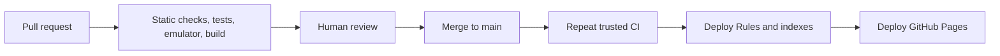

# Testing and CI/CD

## Agent delivery workflow

Substantial changes are delivered specification-first:

1. Create and approve `docs/specifications/<slug>/SPEC.md`.
2. Create and approve the sibling `PLAN.md`.
3. Implement only after PLAN approval.
4. Verify the implementation with checks proportionate to the risk.
5. Update current documentation for the new system state.
6. Mark the specifications index entry as implemented.

Approved SPEC and PLAN files are historical records and are not rewritten after
approval. Completion notes, changed behavior, and operational guidance belong
in current documentation, not in frozen planning artifacts.

Frontend work must also use the project frontend skills:

- `frontend-architecture` for feature structure, layering, one component per
  file, separated types, i18n, accessibility, and Firebase boundaries;
- `react-best-practices` for effects, async waterfalls, rendering behavior,
  state derivation, and performance review.

Git and pull-request actions are separate publishing steps. Do not stage,
commit, push, or open a pull request unless the user explicitly asks after
reviewing the working tree.

## Test layers

### Static checks

- Prettier `--check`
- ESLint with no warnings
- `tsc --noEmit`
- Vite production build

### Unit tests

Vitest covers pure domain behavior:

- quantity and presence availability;
- empty recipes;
- kg/g and l/ml conversion;
- FIFO allocation;
- allowed order transitions;
- cancellation cutoffs;
- effective consumed status;
- prepared-batch conservation.

### Internationalization tests

Tests must:

- compare the full key sets of `uk` and `en`;
- fail on missing or extra keys;
- initialize i18next with `uk` default and `en` fallback;
- render representative components in both languages;
- reject user-facing literal strings through linting or focused review;
- confirm that enum values are translated only at the presentation boundary.

### Component tests

React Testing Library covers:

- role-based navigation;
- loading, error, and empty states;
- action availability by order status;
- forms and unit conversion;
- expiration warnings;
- language switching and persistence;
- duplicate-submit prevention.

### Security Rules integration

Use `@firebase/rules-unit-testing` with the Firebase Emulator Suite:

- full access matrix;
- multi-document writes;
- immutable audit fields;
- delete denial;
- order ownership.

### End-to-end smoke tests

Playwright against emulators should eventually verify:

1. An administrator creates an ingredient and dish.
2. A user sees a cookable dish.
3. The user creates a cooking request.
4. The administrator completes it.
5. The user sees reserved portions.
6. Concurrent reservations preserve counters.
7. The core flow renders in both `uk` and `en`.

E2E does not block initial scaffolding but should be added after the first
vertical slice.

## Pull-request workflow

`ci.yml` runs for `pull_request` and pushes to `main`:

1. checkout;
2. set up the pinned Node version;
3. `npm ci`;
4. restore npm cache;
5. format check;
6. lint;
7. typecheck;
8. unit and component tests with coverage;
9. locale parity tests;
10. Firestore Emulator Rules tests;
11. production build;
12. upload a build artifact only for trusted `main`.

Default permission is `contents: read`. Untrusted pull-request jobs never
receive Firebase deploy credentials.

## Deployment workflow

After trusted CI succeeds on `main`, `deploy.yml`:

1. downloads or rebuilds `dist`;
2. authenticates Firebase CLI with a service account from GitHub Secrets;
3. deploys Firestore Rules and indexes;
4. uploads the Pages artifact;
5. deploys with official GitHub Pages actions.

Required Pages permissions:

```yaml
permissions:
  contents: read
  pages: write
  id-token: write
```

Rules deploy before the new frontend. Rule changes must remain compatible with
the currently deployed application during the short deployment window.

## Delivery sequence



## Repository protection

Recommended `main` protection:

- require a pull request;
- require successful CI;
- prohibit force pushes;
- require the branch to be current;
- enable Dependabot and secret scanning.

Availability of individual protection features depends on the GitHub plan and
repository type.

## Privacy gate before commit

No automated scanner replaces review. Before any commit:

1. inspect `git status` and the full diff;
2. confirm that no `.env*`, key, certificate, export, or debug file is tracked;
3. search for real email addresses, UIDs, Firebase project IDs, access tokens,
   local absolute paths, and household data;
4. verify that examples use `<placeholders>` or `.test` domains;
5. inspect the built artifact if configuration handling changed.

CI should add:

- a secret-scanning job or GitHub secret scanning;
- a tracked-file check for forbidden environment and credential file patterns;
- dependency auditing with a documented failure policy.

## Coverage

Start with an 80% statement and branch threshold for domain and service modules.
UI coverage is not a goal by itself. Critical transactions, security Rules, and
translation parity require complete decision-path coverage.

## Dependencies

- Commit `package-lock.json`.
- Pin Node in `.nvmrc` and Actions.
- Pin `firebase-tools`.
- Configure weekly Dependabot pull requests.
- Apply major upgrades separately.

## Rollback

Frontend rollback redeploys a previous Git commit. Rules rollback deploys the
previous compatible `firestore.rules` and indexes.

Schema changes must be additive in the MVP. Do not introduce destructive data
migrations without an explicit backup and migration design.
